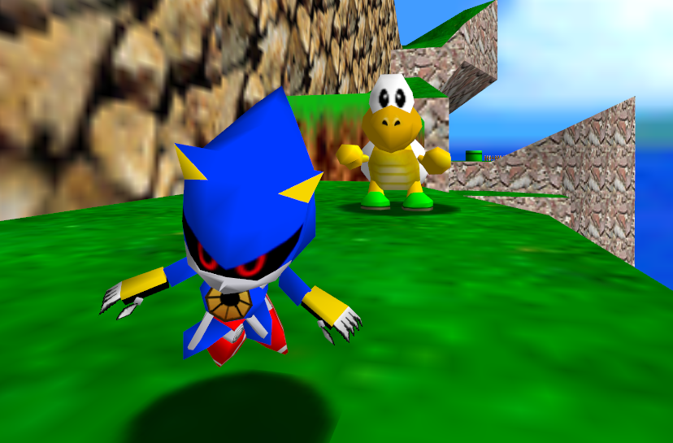
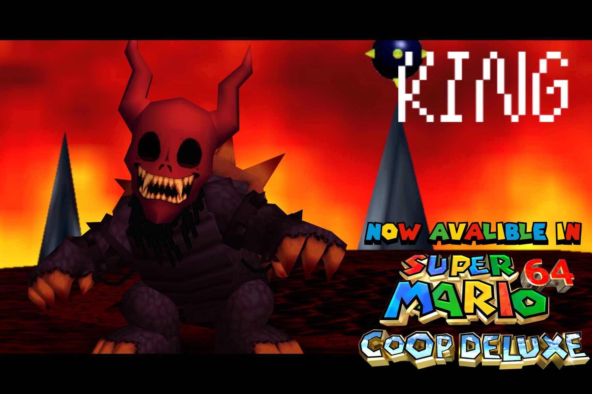
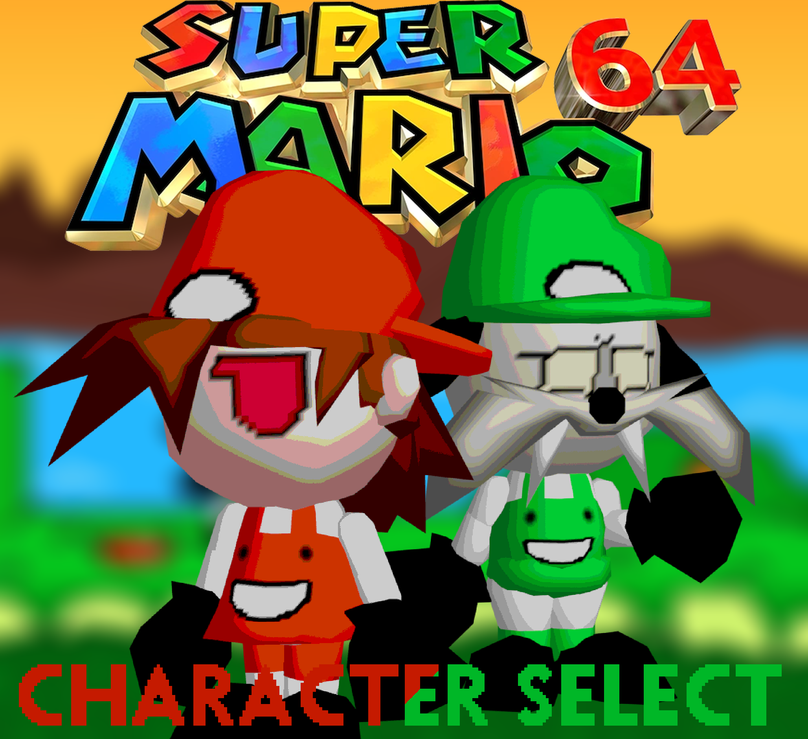
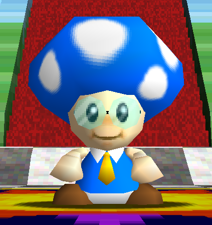
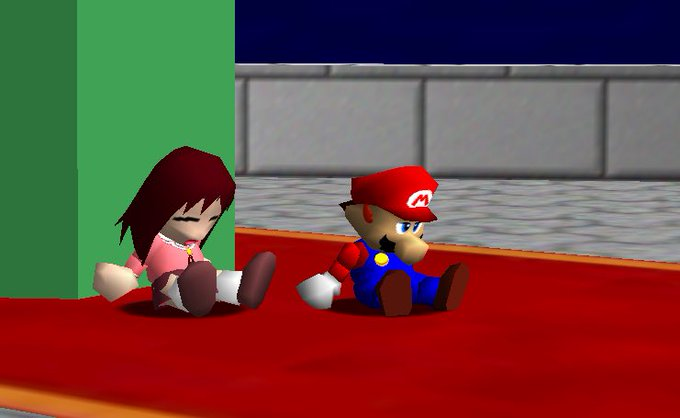

# Pack Catalog

Here you can browse almost every Community Made Pack made for Character Select! This page acts as both a Catalog and an Archive and will be updated with any new packs we become aware of!

### Pack Installation
To install and load a pack, Extract the pack into your mods folder and turn it on as if it were an individual mod. Most if not All in-game pack names are prefixed with "[CS]" and will likely be found at the end of your mod list.

<!--
## Layout Template - [Download](Raw Zip Link)

<table>
<tr>
<td width="440">

</td>
<td width="550">

Description

- Creator(s)
  - nil
- Characters - X
  - nil

</td>
</tr>
</table>
-->

## VL-Tone & Cjes Luigi - [Download](https://github.com/Squishy6094/character-select-coop/raw/main/packs/char-select-cjes-and-vl/download.zip)

<table>
<td width="440">

</td>
<td width="550">

Alternate Luigi Models from way-back-when, Reminiscing of a time before L was Real.

- Creator(s)
  - Coop DX Team
- Characters - 2
  - VL-Tone Luigi
  - Cjes Luigi

</td>
</tr>
</table>

## Extra Characters - [Download](https://github.com/Squishy6094/character-select-coop/raw/main/packs/char-select-extra-chars/download.zip)

<table>
<tr>
<td width="440">

</td>
<td width="550">

More characters from the Super Mario series!

- Creator(s)
  - Coop DX Team
- Characters - 1
  - Toadette

</td>
</tr>
</table>

## Metal Sonic - [Download](https://github.com/Squishy6094/character-select-coop/raw/main/packs/char-select-metal-sonic/download.zip)

<table>
<tr>
<td width="440">

</td>
<td width="550">

the guy from sonic cd who abuses animals now in sm64

- Creator(s)
  - Warioplier
- Characters - 1
  - Metal Sonic

</td>
</tr>
</table>

## King The Memer (v0.9 Beta) - [Download](https://github.com/Squishy6094/character-select-coop/raw/main/packs/king-in-coop-remake-v0.9/download.zip)

<table>
<tr>
<td width="440">

</td>
<td width="550">

King is back again, and this time he has an all new moveset and an entirely new, cleaner model!

- Creator(s)
  - King the Memer
- Characters - 2
  - King the Memer
  - Old Friend (Unlockable)

</td>
</tr>
</table>

## Birdo Pack - [Download](https://github.com/Squishy6094/character-select-coop/raw/main/packs/char-select-birdo/download.zip)

<table>
<tr>
<td width="440">

</td>
<td width="550">

Birdo made playable using Character Select :]

- Creator(s)
  - Melzinoff
- Characters - 1
  - Birdo

</td>
</tr>
</table>

## Wapeach - [Download](https://github.com/Squishy6094/character-select-coop/raw/main/packs/char-select-wapeach/download.zip)

<table>
<tr>
<td width="440">

</td>
<td width="550">

That famous unused Wapeach!! Here to claim back that throne from Peach!!

- Creator(s)
  - Melzinoff
  - SodaVampyr (Voice Actor)
- Characters - 1
  - Wapeach

</td>
</tr>
</table>

## Paper Partners 64 - [Download](https://github.com/Squishy6094/character-select-coop/raw/main/packs/char-select-paper-partners-64/download.zip)

<table>
<tr>
<td width="440">

</td>
<td width="550">

Skinpack of famous friends from the Paper Mario series!

- Creator(s)
  - Melzinoff
- Characters - 11
  - Goombella
  - Goombario
  - Kooper
  - Koops
  - Parakarry
  - Bombette
  - Admiral Bobbery
  - Watt
  - Sushie
  - Lakilester
  - Lady Bow

</td>
</tr>
</table>

## Bowser Moveset - [Download](https://github.com/Squishy6094/character-select-coop/raw/main/packs/char-select-bowser-moveset/download.zip)

<table>
<tr>
<td width="440">

</td>
<td width="550">

Bowser is now playable in SM64ex-coop! This mod works standalone, and has compatibility with Character Select that includes additional features!! Includes a shell spin move (crouch+B, moving), fireball (crouch+B), and various other tweaks and animations!

- Creator(s)
  - Wibblus
- Characters - 2
  - Bowser
  - Bowser Jr.

</td>
</tr>
</table>

## King - [Download](https://github.com/Squishy6094/character-select-coop/raw/main/packs/char-select-king-creepypasta/download.zip)

<table>
<tr>
<td width="440">

</td>
<td width="550">

Model commission for springshady's character! Made for Character Select and has compatability with Bowser Moveset!

- Creator(s)
  - Wibblus
  - SpringShady (Original Character)
- Characters - 1
  - King

</td>
</tr>
</table>

## Geno + Mallow - [Download](https://github.com/Squishy6094/character-select-coop/raw/main/packs/char-select-smrpg/download.zip)

<table>
<tr>
<td width="440">

</td>
<td width="550">

Geno and Mallow made playable with Character Select!

- Creator(s)
  - Wibblus
  - Melzinoff
- Characters - 2
  - Geno
  - Mallow

</td>
</tr>
</table>

## Dry-Bones Pack - [Download](https://github.com/Squishy6094/character-select-coop/raw/main/packs/char-select-drybones/download.zip)

<table>
<tr>
<td width="440">

</td>
<td width="550">

A Dry Bones Player Model!

- Creator(s)
  - Wibblus
- Characters - 1
  - Dry-Bones

</td>
</tr>
</table>

## Nabbit - [Download](https://github.com/Squishy6094/character-select-coop/raw/main/packs/char-select-nabbit/download.zip)

<table>
<tr>
<td width="440">

</td>
<td width="550">

Nabbit is playable with Character Select!!

- Creator(s)
  - Wibblus
- Characters - 1
  - Nabbit

</td>
</tr>
</table>

## Unstoppable Force - [Download](https://github.com/Squishy6094/character-select-coop/raw/main/packs/char-select-unstoppable-force/download.zip)

<table>
<tr>
<td width="440">

</td>
<td width="550">

mari and rufus from the hit classic game mari's pizzaworld

- Creator(s)
  - Tyluge
- Characters - 2
  - Mari
  - Rufus

</td>
</tr>
</table>

## Toadbert - [Download](https://github.com/Squishy6094/character-select-coop/raw/main/packs/char-select-toadbert/download.zip)

<table>
<tr>
<td width="440">

</td>
<td width="550">

It's that one extremely underrated Toad from partners of time.
"By Boogity" -Toadbert

- Creator(s)
  - xLuigiGamerx
  - Yuyake (Toadette Blend File)
- Characters - 1
  - Toadbert

</td>
</tr>
</table>

## Osaka - [Download](https://github.com/Squishy6094/character-select-coop/raw/main/packs/char-select-osaka/download.zip)

<table>
<tr>
<td width="440">

</td>
<td width="550">

OSAKA!!!!! but mario 64ified :3

- Creator(s)
  - [Nokia](https://twitter.com/Nokiaa__)
  - [Azumari](https://twitter.com/azumadeline) (Texturing)
- Characters - 1
  - Osaka

</td>
</tr>
</table>

## Furry Friends Pack - [Download](https://github.com/Squishy6094/character-select-coop/raw/main/packs/char-select-furry-friends/download.zip)

<table>
<tr>
<td width="440">

</td>
<td width="550">

A Pack the features characters/sonas of Yuyake's Friends, including Yuyake Himself!

- Creator(s)
  - AngelicMiracles
- Characters - 8
  - Yuyake
  - Brianna
  - Veph
  - Dirk
  - Bradly
  - Mina
  - Kuma
  - Skipper

</td>
</tr>
</table>
 
## Travis Touchdown - [Gamebanana Page](https://gamebanana.com/mods/492732)

<table>
<tr>
<td width="440">

</td>
<td width="550">

It's payback time!

Well, this is my first mod for SM64, so there's definitely gonna be some jank! But hey, Travis is in the Mushroom Kingdom!

So, Travis has expressions, a voice, and a hud icon! But he has no palette support.
He also will use Luigi's moves if you're using the Character Moveset mod!

- Creator(s)
  - bbbbbeatle
- Characters - 1
  - Travis
 
###### Note: This Pack is Stored on an External Website, and may not always be available!

</td>
</tr>
</table>

## SUPER SPAMTON 64 COOP - [Gamebanana Page](https://gamebanana.com/mods/497381)

<table>
<tr>
<td width="440">

</td>
<td width="550">

SPAMTON 64 [With the help of your friends,] IS FINALLY [Help! Release me!] WITH FULL PERMISSION FROM [The one pulling the strings], BWGLite!!!!

WITH THE HELP OF [Character Select Library is required]. EVEN FEATURING CUSTOM MUSIC WITH [Optional DLC]!!!

[Buy Now]!!!

- Creator(s)
  - Vaporluck
  - BWGLite (Original Mod)
- Characters - 1
  - Spamton

  
###### Note: This Pack is Stored on an External Website, and may not always be available!

</td>
</tr>
</table>
 
## Squid Sisters - [Download](https://github.com/Squishy6094/character-select-coop/raw/main/packs/char-select-squid-sisters/download.zip)

<table>
<tr>
<td width="440">

</td>
<td width="550">

Splatoon's Callie & Marie in SM64! Includes Full Color Support and Eye States!

- Creator(s)
  - Frijoles Y Queso
- Characters - 2
  - Callie
  - Marie

</td>
</tr>
</table>

## Blue Archive Characters - [Gamebanana Page](https://gamebanana.com/mods/478354)

<table>
<tr>
<td width="440">

</td>
<td width="550">

- Creator(s)
  - HerosLight
  - Hash.py (Made Hare and Hare (Camp))
  - Anonymous Veritas Scripter (Made the lua script less copy/paste-y & attempting to fix the voice disappearing issue)
  - Anonymous BA Fan (Helping with Voice mod)
- Characters - Too Many! (20+)

###### Note: This Pack is Stored on an External Website, and may not always be available!

</td>
</tr>
</table>

## Peter Griffin - [Download](https://github.com/Squishy6094/character-select-coop/raw/main/packs/char-select-peter-griffin/download.zip)

<table>
<tr>
<td width="440">

</td>
<td width="550">

It seems today...

- Creator(s)
  - Trashcam
- Characters - 1
  - Peter Griffin

</td>
</tr>
</table>

## Uncle Grandpa - [Download](https://github.com/Squishy6094/character-select-coop/raw/main/packs/char-select-uncle-grandpa/download.zip)

<table>
<tr>
<td width="440">

</td>
<td width="550">

Good Morning! Uncle Grandpa in Super Mario 64, Stylized to look 2D and Includes Eye States!

- Creator(s)
  - Garlicker (Modeling)
  - Dj Khaled/Wahooo (Importing)
  - Fbell(Importing)
  - LuigiGamer(Importing)
- Characters - 1
  - Uncle Grandpa

</td>
</tr>
</table>

## Classic Amy - [Download](https://github.com/Squishy6094/character-select-coop/raw/main/packs/char-select-amy/download.zip)

<table>
<tr>
<td width="440">

</td>
<td width="550">

Geno and Mallow made playable with Character Select!

Classic Amy CS pack by flipflop bell!

- Creator(s)
  - Flipflop Bell
- Characters - 1
  - Amy

</td>
</tr>
</table>

## Scott the Woz - [Download](https://github.com/Squishy6094/character-select-coop/raw/main/packs/char-select-scott-the-woz/download.zip)

<table>
<tr>
<td width="440">

</td>
<td width="550">

Hey all, Scott Here!

- Creator(s)
  - ArcyThePuppet
- Characters - 1
  - Scott The Woz

</td>
</tr>
</table>
