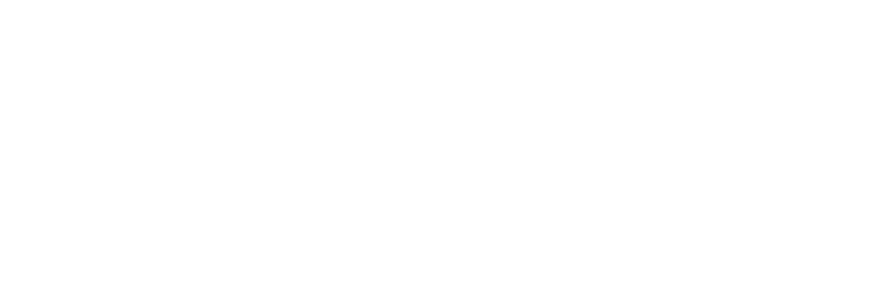

  

### 
 A Model Selector for SM64CoopDX with an Extensive API and tons of Support!

  

 

 Our main goal is to make Character Creation on Lua's end as simple as possible, and to move away from the old Skin Pack mod people keep copying and pasting. With this goal in mind, we tried to make everything as streamlined as possible throughout the character addition process, while allowing for tons of customizability! 

### 
⭐ [Download Here](https://github.com/Squishy6094/character-select-coop/releases) ⭐ - 🧰 [CoopDX Forum Upload](https://mods.sm64coopdx.com/mods/character-select.149/) 🧰

## Resources
- **[CoopDX Forums - Character Select](http://mods.sm64coopdx.com/mods/categories/character-select.14/)** - Browse Character Select Packs hosted on the CoopDX Forums
- **[API Documentation](https://github.com/Squishy6094/character-select-coop/wiki/API-Documentation)** - Gives Full Information on the Character Select's API!
  - **[Pack Template](https://github.com/Squishy6094/char-select-template/archive/refs/heads/main.zip)** - A template based on the documantation to kick off your first pack!
- **[Squishy Community](https://discord.gg/2bg2FnFp6f)** - The Squishiest Server for Help and Support! >.<
- **[SM64CoopDX](https://sm64coopdx.com)** - The SM64CoopDX Website, Which this project was primarily made for!

