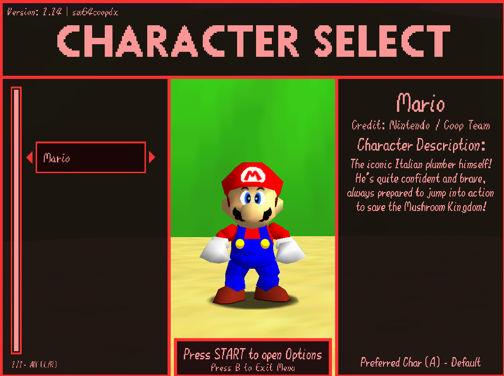

  

### 
 A Model Selector for SM64CoopDX with an Extensive API and tons of Support!

  <!--width=""-->
 

 Our main goal is to make Character Creation on Lua's end as simple as possible, and to move away from the old Skin Pack mod people keep copying and pasting. With this goal in mind, we tried to make everything as streamlined as possible throughout the character addition process, while allowing for tons of customizability! 

### 
 🛠️ [Pack Catalog](/Pack-Catalog.md) 🛠️ - ⭐ [Download Here](https://github.com/Squishy6094/character-select-coop/releases) ⭐ - 💸 [Commissions](/Commissions.md) 💸 

## Resources
- [API Documentation](/API-Docs.md) - Gives Full Information on the Character Select's API, Including a Model Template Pack!
- [Squishy's Server | Discord Server](https://discord.gg/2bg2FnFp6f) - Full Help and Support for those who need it!
- [SM64CoopDX](https://sm64coopdx.com) - The SM64CoopDX Website, Which this project was primarily made for!

